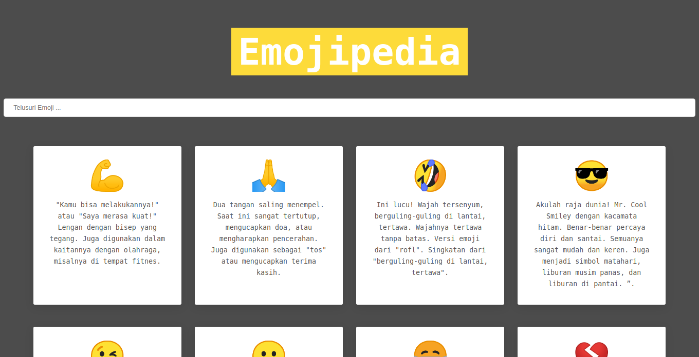
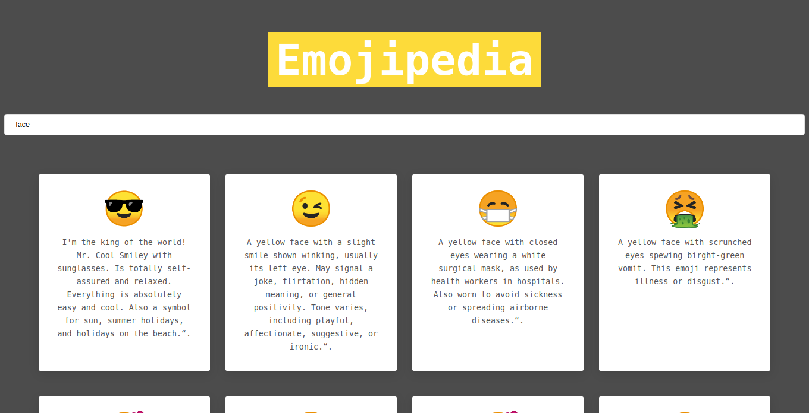

# Emojipedia
A wikipedia of emojis. Yes! Emojis too have meanings! And each one of it is  unique and interesting in itself 😉.

## Description
Ever saw an emoji and thought "Dude! What does this emoji mean? When can we use this one?"🤔. 
Well, no need to worry now, this EMOJIPEDIA will make your life easier. 😇 It gives a brief description about different emojis, so that you need not be limited to those usual emojis and can easily find a perfect emoji for your imperfect situation. 😄

## Check out our awesome website


Find it [here](https://9muu7.csb.app/). We welcome anyone and everyone to _contribute._

Ever had that moment where you wondered, 'what on earth is that emoji'? 🤔 
Yeah, us too. But with Emojipedia, you get a brief description about different emojis. You'll no longer be limited to the run-of-the-mill emojis, and will easily find the perfect fit. Self-expression couldn't get easier. 😄


## Used
Fork this repository. 📌
Clone it to your local computer using command. 💻🖥️
```
git clone
```
Add the repository for `upstream`, to match `origin` and `upstream`.
```
git remote add upstream https://github.com/RishabhDevbanshi/Emojipedia.git
``` 
When to keep your local repo up-to-date with this repository. 🧮
```
git pull upstream master
```
Make required changes and improvements. 🧠
Make a pull request. ✌️

Don't forget to give this repository a star! ⭐

## Feel Free to open a issue
- If you find errors or _bugs_.
- Something isn't rendering properly.
- Have an idea to _contribute_ to the project.

## Feature
* [x] Search By Emoji Name
* [x] Responsive Design

All feedbacks and suggestions are welcome! Everyone can _contribute_ toward this project✨. Just __FORK__ and make a __PR.__

